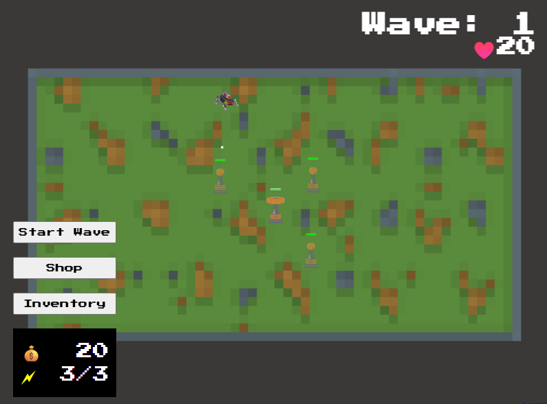
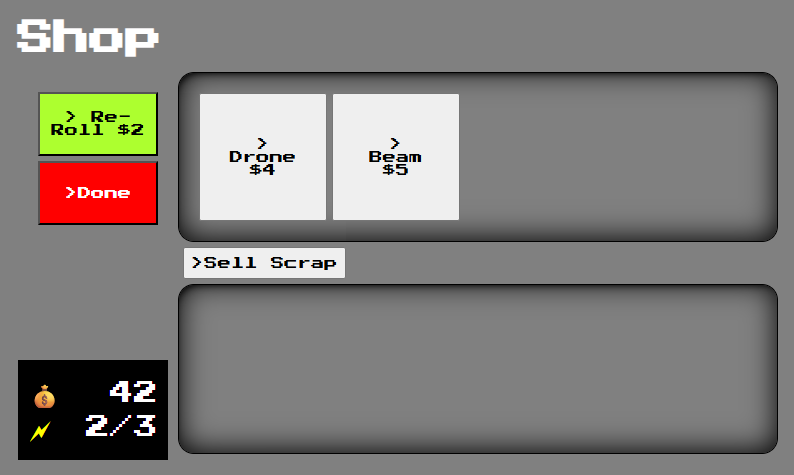
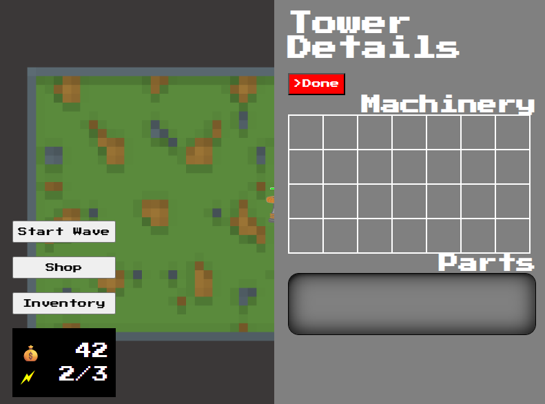
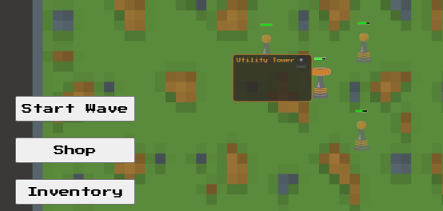

# THE LAST STAND


A thrilling tower defense game built with [Excalibur.js](https://excaliburjs.com/) for the GameDev.js Jam 2026. Defend your base
against relentless waves of enemies using strategic tower placement and powerful upgrades!

## Screenshots






## Game Overview

In **THE LAST STAND**, you command a power plant that generates energy to deploy various defensive towers. Protect your base from
increasingly challenging enemy waves by strategically placing towers, collecting loot from defeated enemies, and upgrading your
arsenal.

## Features

- **Procedural Map Generation**: Each playthrough features a unique battlefield layout
- **Multiple Tower Types**: Deploy different towers with unique abilities:
  - **Burst Tower**: Fires rapid projectiles at nearby enemies
  - **Homing Missile Tower**: Launches guided missiles that track targets
  - **Laser Beam Tower**: Delivers continuous damage to single targets
  - **Drone Launcher**: Deploys autonomous drones for area control
- **Enemy Variety**: Face different enemy types with unique behaviors and weapons
- **Loot System**: Collect valuable components from defeated enemies to upgrade your towers
- **Wave-Based Gameplay**: Survive increasingly difficult enemy waves
- **Inventory Management**: Manage your collected loot and tower upgrades
- **Retro Pixel Art**: Enjoy charming 16-bit style graphics and animations
- **Sound Effects**: Immersive audio with mute/unmute functionality

## How to Play

1. **Start the Game**: Click the "Start" button on the title screen
2. **Place Towers**: Click and hold on the Power Tower to open the menu, then select a tower type to place
3. **Strategic Placement**: Position towers on grass tiles (avoid gray stone tiles)
4. **Begin Waves**: Click "Start Wave" to unleash enemy attacks
5. **Defend**: Use your towers to eliminate enemies before they reach your base
6. **Collect Loot**: Gather dropped components from defeated enemies
7. **Upgrade**: Use collected loot to enhance your tower capabilities

### Controls

- **Mouse**: Click and hold Power Tower to access tower menu
- **Mouse**: Click to place selected towers on valid tiles
- **UI Buttons**: Navigate menus and start waves
- **Mute Button**: Toggle sound effects (bottom-right corner)

### Prerequisites

- Node.js (v16 or higher)
- npm or yarn

### Setup

1. Clone the repository:

   ```bash
   git clone https://github.com/jyoung4242/GameDevJS2026Jam.git
   cd GameDevJS2026Jam
   ```

2. Install dependencies:

   ```bash
   npm install
   ```

3. Start the development server:

   ```bash
   npm run dev
   ```

4. Open your browser and navigate to `http://localhost:5173`

## Development

### Tech Stack

- **Engine**: [Excalibur.js](https://excaliburjs.com/) - 2D game engine for TypeScript
- **Build Tool**: [Vite](https://vitejs.dev/) - Fast build tool and dev server
- **Language**: TypeScript
- **Audio**:
  - JSFXR plugin for procedural sound generation and custom sounds
  - Abelton and Splice for music and custom sounds
- **UI**:
  - Custom UI components with Lit
  - Excalibur Screen Elements UIFramework

## Assets

- **Graphics**: Custom pixel art created with Aseprite
- **Fonts**: Press Start 2P for retro gaming aesthetic [License](https://fonts.google.com/specimen/Press+Start+2P/license)
- **Sounds**: Procedurally generated sound effects with JSFXR [JSFXR](https://sfxr.me/)

## Credits

- **Engine**: Built with [Excalibur.js](https://excaliburjs.com/)

- Development (code):
  - Justin Young [Itch Page](https://mookie4242.itch.io/) | [Game Dev Library](https://jyoung4242.github.io/Game-Dev-Library/)
  - Erik Onarheim [Web Site](https://erikonarheim.com/)
- Music and SFX:
  - Tim Peterson [Web Site](https://timpeterson.me/)
- Art:
  - Matt Onarheim

---

**Enjoy defending your last stand! 🏰⚔️**
